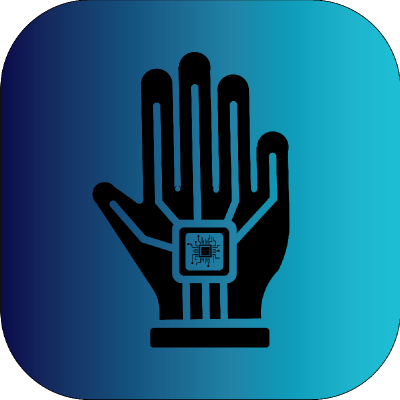

# MyStroke

    

<!----------------------------- คำอธิบาย ----------------------------->

&nbsp&nbsp&nbsp&nbsp&nbsp ผู้ป่วยหลังจากเกิดโรคหลอดเลือดในสมองส่วนใหญ่ประสบภาวะแทรกซ้อนเป็นอาการเกร็ง อ่อนแรง อัมพาต กับอวัยวะที่สำคัญอย่างมือ เราพัฒนา Object Detection ที่เทรนด้วยชุดข้อมูลที่ทางเราเก็บเองในการตรวจจับและแยกประเภทลักษณะท่ายืด ฟื้นฟูบำบัด ของมือแต่ละท่าจะมีผลต่อมัดกล้ามเนื้อที่แตกต่างกัน โดยการให้ผู้ป่วยบำบัดอยู่ในรูปแบบ Gamificationโดยสั่งการและแสดงผลผ่าน mobile application ผู้ป่วยที่มีภาวะแทรกซ้อนจากโรคหลอดเลือดในสมองที่ได้ทดลองใช้งานแอพลิเคชั่นมีความบกพร่องในการเปลี่ยนท่าฉับพลันแต่หลังจากที่ได้ทดลองใช้งานแอพพลิเคชั่นไประยะหนึ่งจากแนวโน้มของคะแนนสามารถสังเกตให้เห็นได้ว่าผู้ป่วยมีแนวโน้มที่จะฟื้นฟูสมรรถภาพได้มากขึ้นเรื่อย ๆ 

<!----------------------------- วัตถุประสงค์ ----------------------------->
## วัตถุประสงค์
1. เพื่อสร้างแรงจูงใจในการบำบัดอาการแทรกซ้อนในมือของผู้ป่วยโรคหลอดเลือดสมอง
2. เป็นเครื่องมือบำบัดต้นทุนต่ำในการบำบัดและวิเคราะห์อาการแทรกซ้อนของผู้ป่วยที่รอดชีวิตจากโรคหลอดเลือดสมองเพื่อให้สามารถกลับมาใช้มือในชีวิตประจำวันอีกครั้งได้
3. เพื่อลดภาระของบุคลากรทางการแพทย์ในการดูแลผู้ป่วยอีกทั้งยังเป็นอุปกรณ์ที่ช่วยให้แพทย์สามารถติดตามผลผู้ป่วยและวินิจฉัยได้ง่ายขึ้น

<!----------------------------- วัสดุอุปกรณ์ ----------------------------->
## วัสดุอุปกรณ์
### Software

    
    
      
    
    
    

### Hardware
- Webcam Camera
- Smartphone